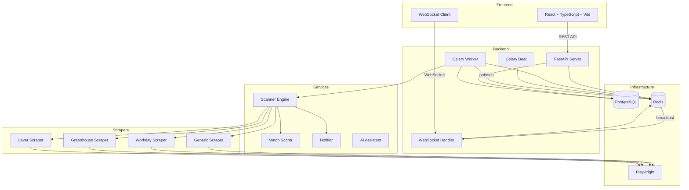

# Hunter - Job Search Automation

A self-hosted, single-user platform that automates your job search pipeline — from discovering listings across multiple job boards, to scoring them against your preferences, to tracking your applications through every stage. Everything runs locally via Docker Compose.

> **See also:** [backend/README.md](backend/README.md) | [frontend/README.md](frontend/README.md) | [scrapers/README.md](scrapers/README.md) for detailed file-by-file documentation.

## Architecture



## Features

- **Job Board Manager** - Add/configure job boards with custom scraper settings
- **Automated Scanning** - Celery periodic tasks scan boards on configurable intervals
- **Smart Matching** - Score jobs 0-100 based on keyword overlap, title similarity, location preference
- **Full-Text Search** - PostgreSQL tsvector/tsrank for fast job searching
- **Real-Time Updates** - WebSocket push when new jobs are discovered
- **Application Tracker** - Track applications through applied, interviewing, offered, rejected, withdrawn stages
- **Bulk Operations** - Select and delete/archive multiple applications at once
- **AI Assistant** - Claude API available for generating answers to application questions
- **Email Notifications** - Resend or SMTP alerts for new jobs
- **Dashboard** - Stats, charts, activity feed, real-time status

> **Future:** A Chrome extension (phase 2) will auto-fill application forms in your real browser using your Hunter profile, and log applications back to the tracker.

## Quick Start

### Prerequisites

- Docker and Docker Compose
- (Optional) Node.js 20+ and Python 3.12+ for local development

### Setup

```bash
# Clone and configure
cp .env.example .env
# Edit .env with your settings (API keys, email, etc.)

# Start all services
docker compose up -d

# The app will be available at:
# Frontend: http://localhost:5173
# Backend API: http://localhost:8000
# API docs: http://localhost:8000/docs
```

### Local Development (without Docker)

```bash
# Backend
cd backend
python -m venv venv
source venv/bin/activate
pip install -r requirements.txt
playwright install chromium

# Start PostgreSQL and Redis locally, then:
alembic upgrade head
uvicorn app.main:app --reload --port 8000

# Celery worker (separate terminal)
celery -A app.tasks.celery_app worker --loglevel=info

# Celery beat (separate terminal)
celery -A app.tasks.celery_app beat --loglevel=info

# Frontend
cd frontend
npm install
npm run dev
```

## Environment Variables

| Variable | Description | Default |
|---|---|---|
| `POSTGRES_USER` | PostgreSQL username | `hunter` |
| `POSTGRES_PASSWORD` | PostgreSQL password | (required) |
| `POSTGRES_DB` | PostgreSQL database name | `hunter` |
| `DATABASE_URL` | Full database connection string | Auto-constructed |
| `REDIS_URL` | Redis connection URL | `redis://redis:6379/0` |
| `RESEND_API_KEY` | Resend API key for email notifications | (empty) |
| `NOTIFICATION_FROM_EMAIL` | Sender email address | `hunter@yourdomain.com` |
| `NOTIFICATION_TO_EMAIL` | Recipient email for alerts | (empty) |
| `SMTP_HOST` | SMTP server hostname (fallback) | `smtp.gmail.com` |
| `SMTP_PORT` | SMTP server port | `587` |
| `SMTP_USER` | SMTP username | (empty) |
| `SMTP_PASSWORD` | SMTP password | (empty) |
| `ANTHROPIC_API_KEY` | Claude API key for AI assistant | (empty) |
| `ANTHROPIC_MODEL` | Claude model to use | `claude-sonnet-4-20250514` |
| `SECRET_KEY` | Application secret key | `change-this...` |
| `BACKEND_CORS_ORIGINS` | Allowed CORS origins (comma-separated) | `http://localhost:5173` |
| `LOG_LEVEL` | Logging level | `INFO` |
| `PLAYWRIGHT_HEADLESS` | Run scraper browser in headless mode | `true` |

## Docker Services

| Service | Port | Description |
|---|---|---|
| `postgres` | 5432 | PostgreSQL 16 database |
| `redis` | 6379 | Redis 7 (Celery broker + pub/sub) |
| `backend` | 8000 | FastAPI application server |
| `celery-worker` | - | Background task processor |
| `celery-beat` | - | Periodic task scheduler |
| `frontend` | 5173 | Vite dev server |

## API Endpoints

### Boards
- `GET /api/boards` - List all boards
- `POST /api/boards` - Create a board
- `PUT /api/boards/{id}` - Update a board
- `DELETE /api/boards/{id}` - Delete a board
- `POST /api/boards/{id}/scan` - Trigger manual scan

### Jobs
- `GET /api/jobs` - List jobs (with filters: search, board_id, min_score, location, sort_by, etc.)
- `GET /api/jobs/{id}` - Get job details
- `PATCH /api/jobs/{id}/hide` - Toggle job visibility
- `PATCH /api/jobs/{id}/read` - Mark job as read

### Profile
- `GET /api/profile` - Get user profile
- `PUT /api/profile` - Update profile
- `POST /api/profile/resume` - Upload resume PDF
- `POST /api/profile/education` - Add education entry
- `DELETE /api/profile/education/{id}` - Remove education entry
- `POST /api/profile/experience` - Add work experience
- `DELETE /api/profile/experience/{id}` - Remove work experience

### Applications
- `GET /api/applications` - List applications (optional filters: ?status=applied&search=google)
- `GET /api/applications/{id}` - Get application details with activity log
- `POST /api/applications` - Log a new application
- `PATCH /api/applications/{id}` - Update status or notes
- `DELETE /api/applications/{id}` - Delete an application
- `POST /api/applications/{id}/archive` - Archive an application
- `POST /api/applications/bulk-delete` - Bulk delete applications
- `GET /api/applications/dashboard` - Dashboard statistics

### WebSocket
- `ws://localhost:8000/ws` - Real-time events (new_job, scan_error)

## Application Tracking Flow

1. User finds a job they want to apply to (via Hunter or externally)
2. User applies manually (or via future Chrome extension)
3. Logs the application in Hunter with status "Applied"
4. Updates status as it progresses: Applied → Interviewing → Offered/Rejected/Withdrawn
5. Adds notes (interview dates, contact info, follow-up reminders)
6. Archives old applications to keep the tracker clean
7. Full activity log tracks every status change

## Scraper Configuration

When adding a board, configure the scraper via `scraper_config`:

```json
{
  "scraper_type": "generic",
  "selectors": {
    "job_card": ".job-listing",
    "title": "h3 a",
    "company": ".company-name",
    "location": ".location",
    "link": "a[href]",
    "salary": ".salary",
    "next_page": ".pagination .next"
  },
  "pagination_type": "click",
  "max_pages": 5
}
```

Supported scraper types: `generic`, `workday`, `greenhouse`, `lever`

## Testing

```bash
cd backend
pytest tests/ -v                                    # All tests
pytest tests/test_scanner.py -v                     # Single file
pytest tests/test_scanner.py::TestParseSalary -v    # Single class
```

Tests cover scrapers, scanner, matcher, and API endpoints. No running PostgreSQL or Redis required — unit tests mock Playwright, integration tests use in-memory SQLite with PG type compatibility hooks.

## Tech Stack

- **Frontend**: React 18, TypeScript, Vite, Tailwind CSS, shadcn/ui, Recharts
- **Backend**: Python 3.12, FastAPI, async/await throughout
- **Database**: PostgreSQL 16 with SQLAlchemy ORM, Alembic migrations, full-text search
- **Task Queue**: Celery with Redis broker
- **Scraping**: Playwright (Python) headless browser
- **Real-time**: WebSocket via FastAPI + Redis pub/sub
- **Notifications**: Resend API with SMTP fallback
- **AI**: Claude API for application question answering
- **Infrastructure**: Docker Compose
