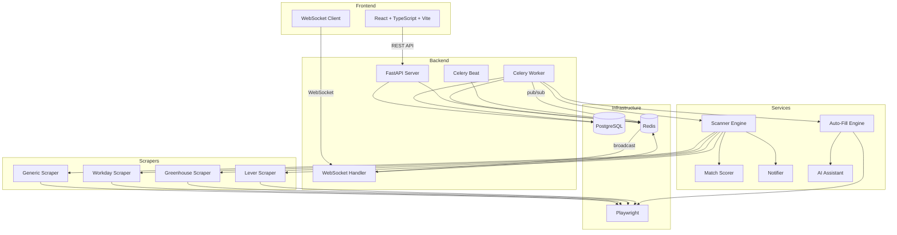

# Hunter - Job Search Automation

A self-hosted, single-user platform that automates your entire job search pipeline — from discovering listings across multiple job boards, to scoring them against your preferences, to filling out and submitting applications with human-in-the-loop review. Everything runs locally via Docker Compose.

> **See also:** [backend/README.md](backend/README.md) | [frontend/README.md](frontend/README.md) | [scrapers/README.md](scrapers/README.md) for detailed file-by-file documentation.

## Architecture



## Features

- **Job Board Manager** - Add/configure job boards with custom scraper settings
- **Automated Scanning** - Celery periodic tasks scan boards on configurable intervals
- **Smart Matching** - Score jobs 0-100 based on keyword overlap, title similarity, location preference
- **Full-Text Search** - PostgreSQL tsvector/tsrank for fast job searching
- **Real-Time Updates** - WebSocket push when new jobs are discovered
- **Auto-Apply Engine** - Playwright-driven form detection, auto-fill, and submission
- **Human-in-the-Loop** - Bot pauses on uncertain fields, CAPTCHAs, free-text questions for review
- **AI-Assisted Answers** - Claude API drafts responses to free-text application questions
- **Email Notifications** - Resend or SMTP alerts for new jobs and review-needed applications
- **Dashboard** - Stats, charts, activity feed, real-time status

## Quick Start

### Prerequisites

- Docker and Docker Compose
- (Optional) Node.js 20+ and Python 3.12+ for local development

### Setup

```bash
# Clone and configure
cp .env.example .env
# Edit .env with your settings (API keys, email, etc.)

# Start all services
docker compose up -d

# The app will be available at:
# Frontend: http://localhost:5173
# Backend API: http://localhost:8000
# API docs: http://localhost:8000/docs
```

### Local Development (without Docker)

```bash
# Backend
cd backend
python -m venv venv
source venv/bin/activate
pip install -r requirements.txt
playwright install chromium

# Start PostgreSQL and Redis locally, then:
alembic upgrade head
uvicorn app.main:app --reload --port 8000

# Celery worker (separate terminal)
celery -A app.tasks.celery_app worker --loglevel=info

# Celery beat (separate terminal)
celery -A app.tasks.celery_app beat --loglevel=info

# Frontend
cd frontend
npm install
npm run dev
```

## Environment Variables

| Variable | Description | Default |
|---|---|---|
| `POSTGRES_USER` | PostgreSQL username | `hunter` |
| `POSTGRES_PASSWORD` | PostgreSQL password | `hunter_secret_change_me` |
| `POSTGRES_DB` | PostgreSQL database name | `hunter` |
| `DATABASE_URL` | Full database connection string | Auto-constructed |
| `REDIS_URL` | Redis connection URL | `redis://redis:6379/0` |
| `RESEND_API_KEY` | Resend API key for email notifications | (empty) |
| `NOTIFICATION_FROM_EMAIL` | Sender email address | `hunter@yourdomain.com` |
| `NOTIFICATION_TO_EMAIL` | Recipient email for alerts | (empty) |
| `SMTP_HOST` | SMTP server hostname (fallback) | `smtp.gmail.com` |
| `SMTP_PORT` | SMTP server port | `587` |
| `SMTP_USER` | SMTP username | (empty) |
| `SMTP_PASSWORD` | SMTP password | (empty) |
| `ANTHROPIC_API_KEY` | Claude API key for AI-assisted answers | (empty) |
| `SECRET_KEY` | Application secret key | `change-this...` |
| `BACKEND_CORS_ORIGINS` | Allowed CORS origins (comma-separated) | `http://localhost:5173` |
| `LOG_LEVEL` | Logging level | `INFO` |
| `PLAYWRIGHT_HEADLESS` | Run browser in headless mode | `true` |

## Docker Services

| Service | Port | Description |
|---|---|---|
| `postgres` | 5432 | PostgreSQL 16 database |
| `redis` | 6379 | Redis 7 (Celery broker + pub/sub) |
| `backend` | 8000 | FastAPI application server |
| `celery-worker` | - | Background task processor |
| `celery-beat` | - | Periodic task scheduler |
| `frontend` | 5173 | Vite dev server |

## API Endpoints

### Boards
- `GET /api/boards` - List all boards
- `POST /api/boards` - Create a board
- `PUT /api/boards/{id}` - Update a board
- `DELETE /api/boards/{id}` - Delete a board
- `POST /api/boards/{id}/scan` - Trigger manual scan

### Jobs
- `GET /api/jobs` - List jobs (with filters: search, board_id, min_score, location, sort_by, etc.)
- `GET /api/jobs/{id}` - Get job details
- `PATCH /api/jobs/{id}/hide` - Toggle job visibility
- `PATCH /api/jobs/{id}/read` - Mark job as read

### Profile
- `GET /api/profile` - Get user profile
- `PUT /api/profile` - Update profile
- `POST /api/profile/resume` - Upload resume PDF
- `POST /api/profile/education` - Add education entry
- `DELETE /api/profile/education/{id}` - Remove education entry
- `POST /api/profile/experience` - Add work experience
- `DELETE /api/profile/experience/{id}` - Remove work experience

### Applications
- `GET /api/applications` - List applications (optional: ?status=needs_review)
- `GET /api/applications/{id}` - Get application details with logs
- `POST /api/applications` - Start auto-apply for a job
- `POST /api/applications/{id}/review` - Submit reviewed form fields
- `POST /api/applications/{id}/cancel` - Cancel application
- `POST /api/applications/{id}/ai-assist` - Request AI-generated answers
- `GET /api/applications/dashboard` - Dashboard statistics

### WebSocket
- `ws://localhost:8000/ws` - Real-time events (new_job, application_update, scan_error)

## Scraper Configuration

When adding a board, configure the scraper via `scraper_config`:

```json
{
  "scraper_type": "generic",
  "selectors": {
    "job_card": ".job-listing",
    "title": "h3 a",
    "company": ".company-name",
    "location": ".location",
    "link": "a[href]",
    "salary": ".salary",
    "next_page": ".pagination .next"
  },
  "pagination_type": "click",
  "max_pages": 5
}
```

Supported scraper types: `generic`, `workday`, `greenhouse`, `lever`

## Auto-Apply Flow

1. User clicks "Auto-Apply" on a job
2. Celery task launches Playwright browser
3. Navigates to job application URL
4. Detects form fields via heuristics (labels, names, placeholders, aria-labels)
5. Auto-fills from user profile with confidence scoring
6. If any field has confidence below threshold, or CAPTCHA detected:
   - **Pauses** the application
   - Takes screenshot
   - Saves form state
   - Notifies user via WebSocket and email
7. User reviews in the Auto-Apply UI:
   - Sees screenshot and field statuses
   - Fills in missing fields
   - Optionally requests AI-generated answers
   - Clicks "Submit Application"
8. Bot resumes, fills reviewed fields, clicks submit
9. Full audit log recorded throughout

## Testing

```bash
cd backend
pytest tests/ -v
```

## Tech Stack

- **Frontend**: React 18, TypeScript, Vite, Tailwind CSS, shadcn/ui, Recharts
- **Backend**: Python 3.12, FastAPI, async/await throughout
- **Database**: PostgreSQL 16 with SQLAlchemy ORM, Alembic migrations, full-text search
- **Task Queue**: Celery with Redis broker
- **Scraping**: Playwright (Python) headless browser
- **Real-time**: WebSocket via FastAPI + Redis pub/sub
- **Notifications**: Resend API with SMTP fallback
- **AI**: Claude API for application question answering
- **Infrastructure**: Docker Compose
