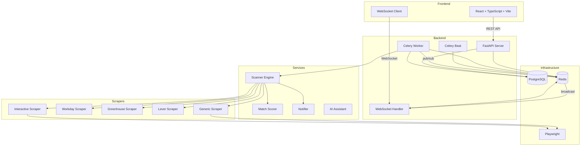

# Hunter - Job Search Automation

A self-hosted, single-user platform that automates your job search pipeline — from discovering listings across multiple job boards, to scoring them against your preferences, to tracking your applications through every stage. Everything runs locally via Docker Compose.

> **See also:** [backend/README.md](backend/README.md) | [frontend/README.md](frontend/README.md) | [scrapers/README.md](scrapers/README.md) for detailed file-by-file documentation.

## Architecture


```mermaid
graph TB
    subgraph Frontend
        UI[React + TypeScript + Vite]
        WS_CLIENT[WebSocket Client]
    end

    subgraph Backend
        API[FastAPI Server]
        WS_SERVER[WebSocket Handler]
        CELERY_W[Celery Worker]
        CELERY_B[Celery Beat]
    end

    subgraph Scrapers
        GENERIC[Generic Scraper]
        WORKDAY[Workday Scraper]
        GREENHOUSE[Greenhouse Scraper]
        LEVER[Lever Scraper]
        INTERACTIVE[Interactive Scraper]
    end

    subgraph Services
        SCANNER[Scanner Engine]
        MATCHER[Match Scorer]
        NOTIFIER[Notifier]
        AI[AI Assistant]
    end

    subgraph Infrastructure
        PG[(PostgreSQL)]
        REDIS[(Redis)]
        PW[Playwright]
    end

    UI -->|REST API| API
    WS_CLIENT -->|WebSocket| WS_SERVER
    API --> PG
    API --> REDIS
    CELERY_W --> PG
    CELERY_W --> REDIS
    CELERY_B --> REDIS
    CELERY_W --> SCANNER
    SCANNER --> GENERIC & WORKDAY & GREENHOUSE & LEVER & INTERACTIVE
    GENERIC & INTERACTIVE --> PW
    SCANNER --> MATCHER
    SCANNER --> NOTIFIER
    WS_SERVER --> REDIS
    CELERY_W -->|pub/sub| REDIS -->|broadcast| WS_SERVER
```

## Features

- **Job Board Manager** — Add/configure job boards with custom scraper settings
- **Automated Scanning** — Celery periodic tasks scan boards on configurable intervals
- **Smart Matching** — Score jobs 0-100 based on keyword overlap, title similarity, location preference
- **Full-Text Search** — PostgreSQL tsvector/tsrank for fast job searching
- **Real-Time Updates** — WebSocket push when new jobs are discovered
- **Application Tracker** — Track applications through applied, interviewing, offered, rejected, withdrawn stages
- **Bulk Operations** — Select and delete/archive multiple applications at once
- **AI Assistant** — Claude API available for generating answers to application questions
- **Email Notifications** — Resend or SMTP alerts for new jobs
- **Dashboard** — Stats, charts, activity feed, real-time status

## Quick Start

### Prerequisites

- Docker and Docker Compose
- (Optional) Node.js 20+ and Python 3.12+ for local development

### Setup

```bash
# Clone and configure
cp .env.example .env
# Edit .env — at minimum set POSTGRES_USER and POSTGRES_PASSWORD

# Start all services
sudo docker compose up -d

# The app will be available at:
# Frontend:  http://localhost:5173
# Backend:   http://localhost:8000
# API docs:  http://localhost:8000/docs
```

The backend runs migrations automatically on startup. Give it ~30 seconds on first launch for Playwright to install Chromium inside the container.

### Common Commands

```bash
sudo docker compose up -d          # Start all services
sudo docker compose restart        # Restart all services
sudo docker compose logs -f backend celery-worker  # Tail logs
sudo docker compose down           # Stop all services
sudo docker compose down -v        # Stop and delete all data
```

## Adding Job Boards

### Via the UI

1. Open http://localhost:5173 and go to **Boards**
2. Click **Add Board**
3. Enter a name and the job board URL
4. Set **keyword filters** (optional) — only jobs matching at least one keyword are kept
5. Configure **scraper settings** — choose a scraper type and provide config (see below)
6. Click **Save**, then **Scan Now** to test

### Via the API

```bash
curl -X POST http://localhost:8000/api/boards \
  -H "Content-Type: application/json" \
  -d '{
    "name": "Walmart",
    "url": "https://walmart.wd5.myworkdayjobs.com/WalmartExternal",
    "keyword_filters": ["software", "engineer", "developer"],
    "scan_interval_minutes": 120,
    "scraper_config": {
      "scraper_type": "auto"
    }
  }'
```

Trigger a manual scan:
```bash
curl -X POST http://localhost:8000/api/boards/{board_id}/scan
```

## Scraper Types

Hunter ships with 6 scraper types. Use `"auto"` and Hunter will pick the best one based on the URL.

### `auto` — Automatic Detection (Recommended)

Detects the job board platform from the URL and selects the best scraper:

| URL Pattern | Detected Scraper |
|---|---|
| `*.greenhouse.io` | Greenhouse API |
| `*.lever.co` | Lever API |
| `*.myworkdayjobs.com` | Workday API |
| Everything else | Interactive |

```json
{ "scraper_type": "auto" }
```

### `workday` — Workday ATS (API-based, no browser)

Calls Workday's internal CXS API directly. Fast and reliable. Works with any company that uses Workday for hiring.

**Auto-detects** `tenant` and `site` from the URL. Override if needed:

```json
{
  "scraper_type": "workday",
  "workday_tenant": "walmart",
  "workday_site": "WalmartExternal"
}
```

**Example companies using Workday:**

| Company | URL |
|---|---|
| Walmart | `https://walmart.wd5.myworkdayjobs.com/WalmartExternal` |
| Salesforce | `https://salesforce.wd12.myworkdayjobs.com/External` |
| Boeing | `https://boeing.wd1.myworkdayjobs.com/external` |
| Capital One | `https://capitalone.wd12.myworkdayjobs.com/Capital_One` |
| Target | `https://target.wd5.myworkdayjobs.com/targetcareers` |

### `greenhouse` — Greenhouse ATS (API-based, no browser)

Uses Greenhouse's public REST API. Single request returns all jobs — no pagination needed.

**Auto-detects** the board token from the URL. Override if needed:

```json
{
  "scraper_type": "greenhouse",
  "board_token": "airbnb"
}
```

**Example companies using Greenhouse:**

| Company | URL |
|---|---|
| Airbnb | `https://boards.greenhouse.io/airbnb` |
| Cloudflare | `https://boards.greenhouse.io/cloudflare` |
| Discord | `https://boards.greenhouse.io/discord` |
| Notion | `https://boards.greenhouse.io/notion` |
| Figma | `https://boards.greenhouse.io/figma` |

### `lever` — Lever ATS (API-based, no browser)

Uses Lever's public REST API. Single request returns all jobs.

**Auto-detects** the site slug from the URL. Override if needed:

```json
{
  "scraper_type": "lever",
  "site_slug": "netflix"
}
```

**Example companies using Lever:**

| Company | URL |
|---|---|
| Netflix | `https://jobs.lever.co/netflix` |
| Twitch | `https://jobs.lever.co/twitch` |
| Spotify | `https://jobs.lever.co/spotify` |

### `interactive` — SPA / JavaScript-Heavy Sites

For sites that load jobs dynamically (React, Vue, Angular apps). Launches a real browser, executes a configurable sequence of actions, then extracts jobs either by intercepting API responses or reading the DOM.

**Pre-search actions** (run in order before extraction):

| Action | Description | Example |
|---|---|---|
| `fill` | Type into an input field | `{"action": "fill", "selector": "input[name='q']", "value": "engineer"}` |
| `click` | Click an element | `{"action": "click", "selector": "button[type='submit']"}` |
| `wait` | Wait for page state | `{"action": "wait", "state": "networkidle"}` |
| `scroll` | Scroll the page | `{"action": "scroll", "direction": "bottom", "times": 3}` |
| `select` | Pick a dropdown option | `{"action": "select", "selector": "select#loc", "value": "US"}` |
| `press` | Press a key | `{"action": "press", "key": "Enter"}` |
| `delay` | Wait N milliseconds | `{"action": "delay", "ms": 2000}` |

**API interception** (preferred — gets structured JSON instead of scraping HTML):

```json
{
  "scraper_type": "interactive",
  "pre_search_actions": [
    {"action": "fill", "selector": "input[type='search']", "value": "software engineer"},
    {"action": "click", "selector": "button[type='submit']"},
    {"action": "wait", "state": "networkidle"}
  ],
  "intercept_patterns": ["*/api/jobs*", "*/positions*"],
  "intercept_job_path": "data.jobPostings",
  "intercept_title_key": "title",
  "intercept_location_key": "location",
  "intercept_url_key": "url"
}
```

**DOM fallback** (when there's no API to intercept):

```json
{
  "scraper_type": "interactive",
  "pre_search_actions": [
    {"action": "wait", "state": "networkidle"},
    {"action": "scroll", "direction": "bottom", "times": 5}
  ],
  "selectors": {
    "job_card": ".job-card",
    "title": ".job-title",
    "company": ".company-name",
    "location": ".job-location",
    "link": "a[href]"
  },
  "pagination_type": "click",
  "max_pages": 5
}
```

### `generic` — CSS Selector-Based

The classic approach: define CSS selectors for each field, configure pagination. Good for traditional server-rendered job boards.

```json
{
  "scraper_type": "generic",
  "selectors": {
    "job_card": ".job-listing",
    "title": "h3 a",
    "company": ".company-name",
    "location": ".location",
    "link": "a[href]",
    "salary": ".salary",
    "next_page": ".pagination .next"
  },
  "pagination_type": "click",
  "max_pages": 5
}
```

**Pagination types:** `click` (click a next button), `url_param` (increment page query param), `infinite_scroll` (scroll to load more)

## How Scanning Works

1. **Celery Beat** checks every 60 seconds for boards due for a scan
2. A **Celery Worker** picks up the task, loads the board config, and runs the appropriate scraper
3. Raw jobs are **filtered by keywords** — only jobs matching at least one keyword are kept
4. Jobs are **deduplicated** by URL hash so the same listing is never stored twice
5. Each job gets a **match score** (0-100) based on:
   - **40%** keyword overlap — how many board keywords appear in the job title + description
   - **35%** title similarity — overlap with your desired job title (set in Profile)
   - **25%** location match — exact match, remote preference, or partial city/state match
6. New jobs are **broadcast via WebSocket** to the frontend in real-time
7. **Email notifications** are sent if configured (Resend API or SMTP)

## Application Tracking

1. Find a job you want to apply to (via Hunter or externally)
2. Apply manually (or via future Chrome extension)
3. Log the application in Hunter with status **Applied**
4. Update status as it progresses: Applied → Interviewing → Offered / Rejected / Withdrawn
5. Add notes (interview dates, contact info, follow-up reminders)
6. Archive old applications to keep the tracker clean
7. Full activity log tracks every status change

## Environment Variables

Copy `.env.example` to `.env` and configure:

| Variable | Description | Default |
|---|---|---|
| `POSTGRES_USER` | Database username | `hunter` |
| `POSTGRES_PASSWORD` | Database password | (required) |
| `POSTGRES_DB` | Database name | `hunter` |
| `DATABASE_URL` | Full connection string | Auto-constructed |
| `REDIS_URL` | Redis connection | `redis://redis:6379/0` |
| `RESEND_API_KEY` | Resend email API key | (empty) |
| `NOTIFICATION_FROM_EMAIL` | Sender email | `hunter@yourdomain.com` |
| `NOTIFICATION_TO_EMAIL` | Where to send alerts | (empty) |
| `SMTP_HOST` | SMTP server (fallback) | `smtp.gmail.com` |
| `SMTP_PORT` | SMTP port | `587` |
| `SMTP_USER` | SMTP username | (empty) |
| `SMTP_PASSWORD` | SMTP password | (empty) |
| `ANTHROPIC_API_KEY` | Claude API key (optional) | (empty) |
| `SECRET_KEY` | Application secret key | (required) |
| `BACKEND_CORS_ORIGINS` | Allowed CORS origins | `http://localhost:5173` |
| `LOG_LEVEL` | Logging level | `INFO` |
| `PLAYWRIGHT_HEADLESS` | Headless browser mode | `true` |

## Docker Services

| Service | Port | Description |
|---|---|---|
| `postgres` | 5432 | PostgreSQL 16 database |
| `redis` | 6379 | Redis 7 (Celery broker + pub/sub) |
| `backend` | 8000 | FastAPI application server |
| `celery-worker` | — | Background task processor (4 concurrent) |
| `celery-beat` | — | Periodic task scheduler |
| `frontend` | 5173 | Vite dev server |

## API Endpoints

### Boards
- `GET /api/boards` — List all boards
- `POST /api/boards` — Create a board
- `PUT /api/boards/{id}` — Update a board
- `DELETE /api/boards/{id}` — Delete a board
- `POST /api/boards/{id}/scan` — Trigger manual scan

### Jobs
- `GET /api/jobs` — List jobs (filters: `search`, `board_id`, `min_score`, `location`, `sort_by`)
- `GET /api/jobs/{id}` — Get job details
- `PATCH /api/jobs/{id}/hide` — Toggle job visibility
- `PATCH /api/jobs/{id}/read` — Mark job as read

### Profile
- `GET /api/profile` — Get user profile
- `PUT /api/profile` — Update profile
- `POST /api/profile/resume` — Upload resume PDF
- `POST /api/profile/education` — Add education entry
- `DELETE /api/profile/education/{id}` — Remove education entry
- `POST /api/profile/experience` — Add work experience
- `DELETE /api/profile/experience/{id}` — Remove work experience

### Applications
- `GET /api/applications` — List applications (filters: `status`, `search`)
- `GET /api/applications/{id}` — Get application with activity log
- `POST /api/applications` — Log a new application
- `PATCH /api/applications/{id}` — Update status or notes
- `DELETE /api/applications/{id}` — Delete an application
- `POST /api/applications/{id}/archive` — Archive
- `POST /api/applications/bulk-delete` — Bulk delete
- `GET /api/applications/dashboard` — Dashboard statistics

### WebSocket
- `ws://localhost:8000/ws` — Real-time events (`new_job`, `scan_error`)

## Local Development (without Docker)

```bash
# Terminal 1: Backend
cd backend
python -m venv venv && source venv/bin/activate
pip install -r requirements.txt
playwright install chromium
alembic upgrade head
uvicorn app.main:app --reload --port 8000

# Terminal 2: Celery worker
celery -A app.tasks.celery_app worker --loglevel=info --concurrency=4

# Terminal 3: Celery beat
celery -A app.tasks.celery_app beat --loglevel=info

# Terminal 4: Frontend
cd frontend
npm install && npm run dev
```

Requires PostgreSQL and Redis running locally.

## Testing

```bash
cd backend
pytest tests/ -v                                    # All tests
pytest tests/test_scanner.py -v                     # Single file
pytest tests/test_scanner.py::TestParseSalary -v    # Single class
```

Tests mock Playwright and use in-memory SQLite — no running database required.

## Tech Stack

- **Frontend**: React 18, TypeScript, Vite, Tailwind CSS, shadcn/ui, Recharts
- **Backend**: Python 3.12, FastAPI, async/await throughout
- **Database**: PostgreSQL 16, SQLAlchemy ORM, Alembic migrations, full-text search (tsvector + GIN)
- **Task Queue**: Celery with Redis broker
- **Scraping**: Playwright headless browser + direct ATS API calls
- **Real-time**: WebSocket via FastAPI + Redis pub/sub
- **Notifications**: Resend API with SMTP fallback
- **AI**: Claude API for application question answering
- **Infrastructure**: Docker Compose, all self-hosted
